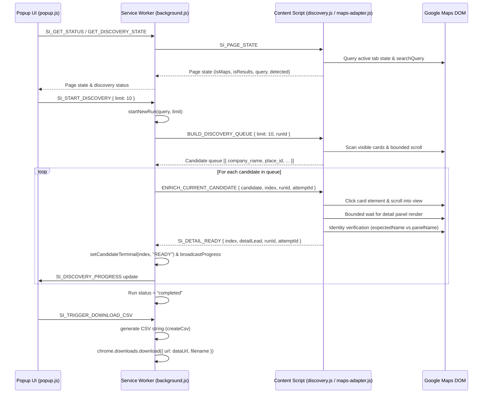

# RAMOS Architecture Specification

## Overview & Scope
**RAMOS** is a standalone, client-side Chrome Extension (Manifest V3) for high-precision lead extraction and detail enrichment directly from Google Maps (`google.com/maps`).

RAMOS operates completely client-side in the user's browser. It has **no dependencies** on external web applications, Supabase databases, backend servers, or third-party API keys. Extracted business leads are processed into a canonical lead format and exported directly to CSV files.

---

## Target Lead Extraction Workflow


1. **Google Maps Search**: User performs any business search query on Google Maps (e.g., `pizza near Satellite, Ahmedabad`).
2. **Result Card Discovery**: DOM content scripts discover visible business result cards, extract initial card metadata, and deduplicate by Google Maps `place_id`.
3. **Sequential Candidate Queue**: The background service worker manages a single-flight candidate queue with per-candidate bounded timeouts (15s).
4. **Detail Panel Enrichment**: Content script clicks candidates sequentially, waits for the detail panel to open, verifies identity matching (`expectedName` vs `panelName`), and extracts rich metadata (phone, website, hours, rating, full address).
5. **Canonical Lead Model**: Extracted attributes are normalized into the `createCanonicalLead` format.
6. **Standalone CSV Export**: User clicks "Download CSV" in the extension popup to generate a UTF-8 BOM CSV file downloaded via `chrome.downloads`.

---

## Component Architecture

```
RAMOS Chrome Extension
├── Manifest & Configuration
│   └── extension/manifest.json (MV3 declaration, permissions: storage, tabs, scripting, downloads, host_permissions: google.com/maps)
├── Extension Popup (User Interface)
│   ├── extension/popup.html (Standalone popup UI: Maps tab status, maximum results limit, discovery control, progress bar, current business preview, summary stats, CSV export button)
│   ├── extension/popup.js (Popup state controller, progress listener, download CSV trigger)
│   └── extension/popup.css (Standalone extension styling & components)
├── Background Service Worker (Single Authority Engine)
│   └── extension/background.js (Run state isolation, candidate queue dispatcher, single-flight candidate tracking, bounded candidate timeouts, CSV string generator & chrome.downloads integration)
├── Google Maps Content Scripts (Isolated World Execution)
│   ├── extension/discovery.js (DOM discovery worker, bounded scroll engine, candidate queue builder, detail panel click dispatch, DOM state observer)
│   └── extension/content/maps/
│       ├── dom-utils.js (DOM query utilities, element scrolling, sleep helpers, place ID extraction)
│       ├── selectors.js (Authoritative DOM selectors for Google Maps search cards, feed, detail panel, search box, end-of-list indicator)
│       ├── validators.js (Field validation rules for company names, phone numbers, ratings, URLs)
│       ├── address-parser.js (City, region, country, postal code extraction from Google Maps address strings)
│       ├── result-card-extractor.js (Search result card metadata extraction & business card qualification)
│       ├── detail-extractor.js (Rich detail panel business data extraction & identity verification)
│       └── maps-adapter.js (Orchestrator module binding extractor scripts to unified API surface)
├── Shared Models & Constants
│   ├── extension/shared/constants.js (Error codes, extraction modes, max results constants)
│   └── extension/shared/schema.js (Canonical Lead schema builder: createCanonicalLead)
└── Verification & Packaging Tooling
    ├── scripts/extension-package.js (Packaging script creating standalone extension ZIP)
    ├── scripts/verify-packaged-extension-parity.js (Parity verification between source directory and packaged ZIP)
    └── extension/tests/ (Node.js test suites: gmaps-card-pipeline.test.ts, gmaps-vadapav-e2e-diagnostic.test.ts)
```

---

## Extension Messaging Architecture & Data Flow



---

## Technical Constraints & Guardrails

1. **Manifest V3 Isolation**: Content scripts execute in an isolated world on `https://www.google.com/maps*`. Service worker handles run state authority.
2. **Single Authority Run Engine**: `currentRun` inside `background.js` tracks candidate states (`PENDING`, `DISPATCHED`, `READY`, `FAILED`, `DUPLICATE_SKIPPED`, `SKIPPED`).
3. **Identity Verification & Stale Protection**: Detail panel responses must pass identity matching (`expectedName` vs `actualName`) and `runId`/`attemptId` validation.
4. **No External Network Dependencies**: RAMOS runs entirely offline/local once loaded in Chrome. No fetch calls to external backends.
