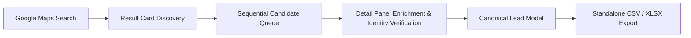
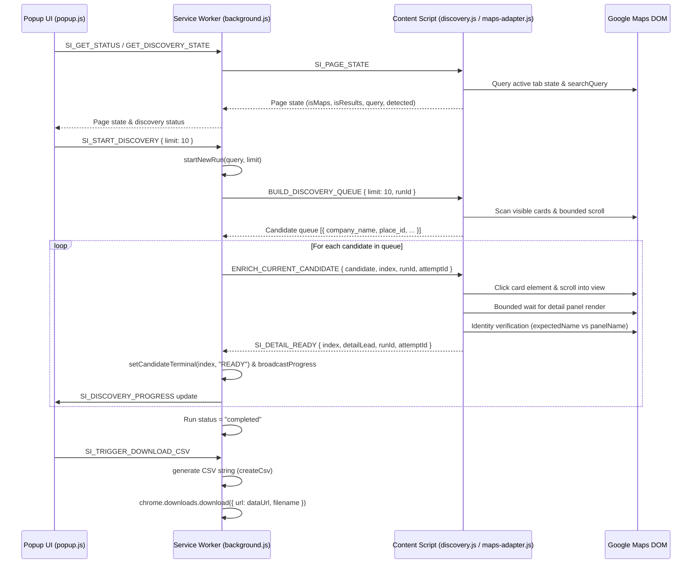

# RAMOS Architecture Specification

## Overview & Scope
**RAMOS** is a standalone, client-side Chrome Extension (Manifest V3) for high-precision lead extraction and detail enrichment directly from Google Maps (`google.com/maps`).

RAMOS operates completely client-side in the user's browser. It has **no dependencies** on external web applications, Supabase databases, backend servers, or third-party API keys. Extracted business leads are processed into a canonical lead format and exported directly to CSV or Excel (.xlsx) files.

---

## Target Lead Extraction Workflow



1. **Google Maps Search**: User performs any business search query on Google Maps (e.g., `pizza near Satellite, Ahmedabad`).
2. **Result Card Discovery**: DOM content scripts discover visible business result cards, extract initial card metadata, and deduplicate by Google Maps `place_id`.
3. **Sequential Candidate Queue**: The background service worker manages a single-flight candidate queue with per-candidate bounded timeouts (15s).
4. **Detail Panel Enrichment**: Content script clicks candidates sequentially, waits for the detail panel to open, verifies identity matching (`expectedName` vs `panelName`), and extracts rich metadata (phone, website, hours, rating, full address).
5. **Canonical Lead Model**: Extracted attributes are normalized into the `createCanonicalLead` format.
6. **Standalone CSV & XLSX Export**: User clicks "Download Excel" or "Download CSV" in the extension popup to generate clean UTF-8 BOM CSV or ECMA-376 OOXML Strict `.xlsx` files downloaded directly via `chrome.downloads`.

---

## Component Architecture

```
RAMOS Chrome Extension
├── Manifest & Configuration
│   └── extension/manifest.json (MV3 declaration, permissions: storage, tabs, scripting, downloads, host_permissions: google.com/maps, http, https)
├── Extension Popup (User Interface)
│   ├── extension/popup.html (Dual-mode UI: Google Maps Tab & Website Intelligence Tab, progress, metrics, people view, export controls)
│   ├── extension/popup.js (Dual-mode controller, Maps runner, Website crawler, batch lead enricher, export trigger)
│   └── extension/popup.css (RAMOS brand styling, dark/light themes, badges, people table, enrich section)
├── Background Service Worker (Single Authority Engine)
│   └── extension/background.js (Maps run state authority, candidate queue dispatcher, bounded candidate timeouts, CSV string generator & downloads)
├── Google Maps Content Scripts (Isolated World Execution - FROZEN)
│   ├── extension/discovery.js (DOM discovery worker, bounded scroll engine, candidate queue builder, detail panel click dispatch)
│   └── extension/content/maps/
│       ├── dom-utils.js (DOM query utilities, element scrolling, sleep helpers, place ID extraction)
│       ├── selectors.js (Authoritative DOM selectors for Google Maps search cards, feed, detail panel, search box)
│       ├── validators.js (Field validation rules for company names, phone numbers, ratings, URLs)
│       ├── address-parser.js (City, region, country, postal code extraction from Google Maps address strings)
│       ├── result-card-extractor.js (Search result card metadata extraction & business card qualification)
│       ├── detail-extractor.js (Rich detail panel business data extraction & identity verification)
│       └── maps-adapter.js (Orchestrator module binding extractor scripts to unified API surface)
├── Website Intelligence Subsystem (Client-Side Targeted Crawler)
│   └── extension/content/website/
│       ├── page-acquisition.js (Sandboxed HTML fetcher & DOMParser instantiation)
│       ├── page-analyzer.js (Page intent classification, OpenGraph & meta extraction)
│       ├── structured-data.js (Schema.org JSON-LD & Microdata extraction for Organization, LocalBusiness, Person)
│       ├── field-extractors.js (Protocol & regex extractors for email, phone, social links, action links)
│       ├── normalizers.js (E.164 phone, email, URL, text cleaners)
│       ├── validators.js (RFC 5322 email role filtering, bogus number rejection, domain bounds)
│       ├── crawl-policy.js (Same-domain boundary enforcement, scheme checking, binary file exclusion)
│       ├── page-priority.js (Heuristic path scoring: /contact, /about, /team, /locations)
│       ├── link-discovery.js (Same-domain link harvester, relative link resolution, anchor context)
│       ├── crawl-queue.js (Bounded BFS queue, max depth <= 2, early exit logic)
│       ├── people-extractor.js (Team card parser, Person schema, clean name/title separation, generic email isolation)
│       ├── confidence.js (7-tier source reliability weighting, corroboration scoring, deterministic conflict resolution)
│       ├── enricher.js (Additive merge of Maps + Website data, Maps authority, _provenance dictionary)
│       └── website-adapter.js (Master facade orchestrating single-page & multi-page crawls)
├── Shared Models & Output Infrastructure
│   ├── extension/shared/constants.js (Error codes, extraction modes, max results constants)
│   ├── extension/shared/schema.js (Canonical Lead schema builder: createCanonicalLead, strict 24-field model)
│   └── extension/shared/xlsx-builder.js (100% browser-native ECMA-376 OOXML Strict XLSX Excel exporter)
└── Verification & Documentation Infrastructure
    ├── docs/RAMOS_STABLE_BASELINE.md (Frozen engineering baseline specification)
    ├── docs/RAMOS_WEBSITE_ARCHITECTURE.md (Website intelligence architecture & pipeline specification)
    ├── docs/RAMOS_WEBSITE_SCRAPER_PHASE_0_1_AUDIT.md (Phase 0.1 architecture audit & Website Scraper reusability analysis)
    ├── docs/RAMOS_FINAL_RELEASE_AUDIT.md (Full baseline hardening and release verification audit)
    ├── scripts/extension-package.js (Packaging script creating standalone extension ZIP)
    ├── scripts/check-project-consistency.js (Automated repository & document consistency checker)
    ├── scripts/verify-packaged-extension-parity.js (Parity verification between source directory and packaged ZIP)
    └── tests/ (Node.js test suites across Maps pipeline and Website Intelligence subsystems)
```

---

## Extension Messaging Architecture & Data Flow



---

## Technical Constraints & Guardrails

1. **Manifest V3 Isolation**: Content scripts execute in an isolated world on `https://www.google.com/maps*`. Service worker handles run state authority.
2. **Single Authority Run Engine**: `currentRun` inside `background.js` tracks candidate states (`PENDING`, `DISPATCHED`, `READY`, `FAILED`, `DUPLICATE_SKIPPED`, `SKIPPED`).
3. **Identity Verification & Stale Protection**: Detail panel responses must pass identity matching (`expectedName` vs `actualName`) and `runId`/`attemptId` validation.
4. **No External Network Dependencies**: RAMOS runs entirely offline/local once loaded in Chrome. No fetch calls to external backends.
