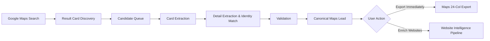
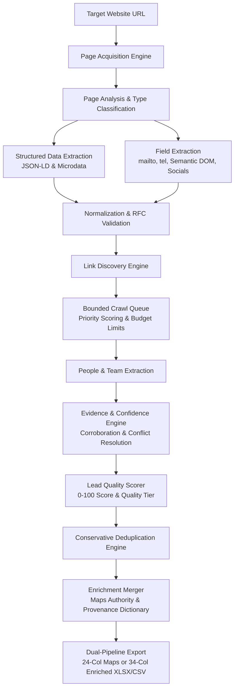

# RAMOS — Current Architecture Specification

**Product Name:** RAMOS – Maps Lead Extractor & Website Intelligence  
**Version:** `v1.0.6`  
**Status:** **PILOT READY / RELEASE CANDIDATE (PERMANENTLY FROZEN)**  
**Distribution:** Unpacked Manifest V3 Chrome Extension (`dist/ramos-maps-connector-v1.0.6.zip`)

---

## 1. Executive Summary & Architecture Overview

**RAMOS** is a standalone, client-side Manifest V3 Chrome Extension engineered for high-precision business lead extraction and enrichment directly within Google Chrome.

RAMOS operates completely client-side in the user's browser. It possesses **zero dependencies** on external servers, Supabase/cloud databases, hosted backend scrapers, third-party API keys, or proxy networks. It strictly enforces:
- **0 runtime npm packages**
- **0 Node.js runtime globals** (`Buffer`, `process`, `fs`, `path`)
- **100% native browser primitives** (`Uint8Array`, `TextEncoder`, `DOMParser`, `fetch`, `chrome.downloads`)

---

## 2. Core Operational Pipelines

RAMOS integrates two distinct, modular pipelines:
1. **Google Maps Extraction Pipeline (Frozen Baseline v1.0.5)**
2. **Website Intelligence Subsystem (Phases 0–9)**

### 2.1 Google Maps Extraction Pipeline



1. **Google Maps Search**: User performs any business search query on Google Maps (e.g. `commercial roofing in Dallas`).
2. **Discovery (`discovery.js`)**: Content script scans the DOM for visible result cards and builds a candidate list.
3. **Candidate Queue (`background.js`)**: Background service worker manages a sequential single-flight queue with per-candidate bounded timeouts (**15,000 ms**).
4. **Card Extraction (`result-card-extractor.js`)**: Extracts initial card metadata (name, rating, category, place ID).
5. **Detail Extraction & Identity Verification (`detail-extractor.js`)**: Content script clicks cards sequentially, waits for detail panel load, verifies identity matching (`expectedName` vs `panelName`), and extracts rich metadata (phone, website, opening hours, full address).
6. **Validation (`validators.js`, `address-parser.js`)**: Validates phone numbers, formats addresses, and extracts `city`, `region`, `country`, and `postal_code`.
7. **Canonical Maps Lead (`schema.js`)**: Normalizes fields into the frozen 24-attribute lead structure.
8. **Optional Website Enrichment**: User can immediately export clean Maps leads OR click `"Enrich Discovered Leads"` to trigger Website Intelligence.

### 2.2 Website Intelligence Pipeline



1. **URL Input / Lead Website**: Accepts a validated URL from user input or a discovered Maps lead.
2. **Acquisition (`page-acquisition.js`)**: Fetches HTML with strict timeout and size limits (max 2.5 MB) and instantiates a sandboxed DOM tree.
3. **Page Analysis (`page-analyzer.js`)**: Classifies page intent (`HOMEPAGE`, `CONTACT`, `ABOUT`, `TEAM`, `SERVICES`, `LOCATION`, `GENERIC`) and extracts OpenGraph metadata.
4. **Structured Data (`structured-data.js`)**: Traverses `<script type="application/ld+json">` and Schema.org microdata for `Organization`, `LocalBusiness`, `ContactPoint`, and `Person`.
5. **Field Extraction (`field-extractors.js`)**: Extracts `mailto:` links, `tel:` links, semantic addresses, social profile links, and action links (booking, ordering, menu).
6. **Normalization & Validation (`normalizers.js`, `validators.js`)**: Normalizes emails (trims, RFC role detection), phone numbers (E.164/international), and URLs; rejects disposable emails and dummy placeholders.
7. **Link Discovery (`link-discovery.js`)**: Discovers internal same-domain links; scores priority based on path and anchor text with dynamic field-awareness.
8. **Bounded Crawl Queue (`crawl-queue.js`)**: Enforces page budgets (1, 5, 10, or 20), max depth 2 hops, deduplication, and field-aware early exit.
9. **People Extraction (`people-extractor.js`)**: Extracts structured team cards and Person schemas; cleanly isolates names from job titles; ranks personnel by seniority tiers (`c_level`, `vp`, `director`, `founder`, `manager`, `staff`).
10. **Evidence & Confidence Engine (`confidence.js`)**: Evaluates 7 tiers of source reliability ($0.50 - 0.98$), applies page-context modifiers, cross-page corroboration bonuses, and deterministic conflict resolution.
11. **Lead Scoring (`lead-scorer.js`)**: Computes transparent lead score (0–100) and assigns `quality_tier` (`HIGH`, `MEDIUM`, `LOW`).
12. **Deduplication (`deduplicator.js`)**: Evaluates duplicate leads conservatively (`place_id`, domain+phone, domain+name similarity); unions discovered contacts without data loss.
13. **Enrichment Merger (`enricher.js`)**: Deterministically merges Maps lead and website intelligence; strictly preserves Maps authority for physical fields; attaches field-level `_provenance` dictionary.
14. **Export Engine (`xlsx-builder.js`, `popup.js`)**: Generates strict 24-column Maps exports or 34-column Enriched exports with 2-sheet XLSX.

---

## 3. Detailed Component Hierarchy

```
RAMOS Chrome Extension (v1.0.6)
├── manifest.json / extension/manifest.json (MV3 declaration, permissions: storage, tabs, scripting, downloads)
├── extension/
│   ├── background.js              # Background Service Worker: single run authority, queue dispatcher, CSV generator
│   ├── discovery.js               # Maps Content Script worker: candidate discovery, bounded scroll, click dispatcher
│   ├── popup.html                 # Dual-mode UI: Google Maps & Website Intelligence tabs, metrics, people table, export buttons
│   ├── popup.js                   # Popup UI controller: state machine, live progress, batch enricher, export routing
│   ├── popup.css                  # RAMOS Design System: Deep Violet theme (#7C3AED), dark/light styling, badges, tables
│   ├── assets/                    # Official icon assets (16x16, 32x32, 48x48, 128x128 PNGs)
│   ├── shared/                    # Shared Infrastructure Modules
│   │   ├── constants.js           # Error codes, extraction modes, result limits
│   │   ├── schema.js              # Canonical 24-attribute lead schema (createCanonicalLead)
│   │   ├── deduplicator.js        # High-precision conservative deduplication & lead merger
│   │   └── xlsx-builder.js        # 100% browser-native ECMA-376 OOXML Strict XLSX generator (buildXlsx & buildWebsiteXlsx)
│   └── content/
│       ├── maps/                  # [FROZEN] Google Maps Extraction Subsystem
│       │   ├── dom-utils.js       # DOM query utilities, element scrolling, sleep helpers, place ID extraction
│       │   ├── selectors.js       # Authoritative DOM selectors for Google Maps search cards, feed, detail panel
│       │   ├── validators.js      # Data field validators for company names, phone numbers, ratings, URLs
│       │   ├── address-parser.js  # Segmenter for city, region, country, postal code from address strings
│       │   ├── result-card-extractor.js # Card metadata extraction & business card qualification
│       │   ├── detail-extractor.js# Detail panel extraction & identity verification
│       │   └── maps-adapter.js    # Orchestrator binding extractor scripts to unified API surface
│       └── website/               # Website Intelligence Subsystem
│           ├── page-acquisition.js# Sandboxed HTML fetcher & DOMParser instantiation
│           ├── page-analyzer.js   # Page classifier, OpenGraph & meta description extractor
│           ├── structured-data.js # Schema.org JSON-LD & Microdata parser for Organization, LocalBusiness, Person
│           ├── field-extractors.js# Extractors for mailto, tel, semantic addresses, social links, action links
│           ├── normalizers.js     # Phone (E.164), email, URL, text cleaning & whitespace normalizers
│           ├── validators.js      # RFC 5322 email role filtering, bogus number rejection, social URL verification
│           ├── crawl-policy.js    # Same-domain boundary enforcement, scheme sanitation, binary & auth exclusions
│           ├── page-priority.js   # URL path & anchor text priority scoring (/contact, /about, /team, /locations)
│           ├── link-discovery.js  # Same-domain link harvester with anchor context & dynamic field-awareness
│           ├── crawl-queue.js     # Dynamic priority queue, depth control (<=2), page budgets, early exit
│           ├── people-extractor.js# Team card parser, Person schema extractor, seniority ranking, primary DM selector
│           ├── confidence.js      # 7-tier source reliability weighting, corroboration bonuses, conflict resolver
│           ├── lead-scorer.js     # Deterministic lead quality scoring (0-100) & quality tier assignment
│           ├── enricher.js        # Merges Maps + Website leads with Maps authority & _provenance dictionary
│           └── website-adapter.js # Master orchestrator for single-page extraction and targeted multi-page crawling
├── dist/                          # Packaged release archives (ramos-maps-connector-v1.0.6.zip)
├── docs/                          # Comprehensive specification & architecture documentation
├── scripts/                       # Packaging, consistency verification, and parity checking utilities
└── tests/                         # Node.js test suites (162 passing tests)
    ├── maps/                      # Google Maps card & detail pipeline regression tests (14 tests)
    ├── website/                   # Website Intelligence unit, crawler, enrichment, and export tests (143 tests)
    └── qa/                        # End-to-end release candidate validation tests (5 tests)
```

---

## 4. Key Architectural Guarantees & Contracts

### 4.1 Authority Precedence Contract

When merging Google Maps leads with Website Intelligence:
1. **Google Maps is Authoritative for Physical Business Attributes**:
   - `company_name`, `phone`, `address`, `city`, `region`, `country`, `postal_code`, `website`.
   - Populated Maps values are **never overwritten** by website data.
   - Website phone and address populate **only if** Maps lacked them.
2. **Website Intelligence is Authoritative for Digital & Personnel Attributes**:
   - `email`, `email_status`, `social` (LinkedIn, Twitter/X, Facebook, Instagram, YouTube, GitHub), `people[]`, `decision_maker_*`, `lead_score`, `quality_tier`.
   - Maps rarely provides email or executive rosters; Website Intelligence enriches them directly.

### 4.2 Strict Personal Contact Isolation

- Direct personal emails (e.g. `john.doe@company.com` extracted from a leadership card) attach **strictly** to `lead.people[i].email` and `lead.decision_maker_email`.
- Employee personal emails are **strictly forbidden** from leaking into the company-wide primary `lead.email`.
- Generic role emails (`info@`, `sales@`, `contact@`) are attached to `lead.email` and `lead.emails[]`, and are never attributed to individual executives.

### 4.3 Multi-Value Contact Preservation

- Corporate emails discovered across pages are retained in `lead.emails[]`. The primary email appears in `lead.email`, and secondary emails are stored in `lead.additional_emails[]`.
- Multiple corporate phone numbers are retained in `lead.phones[]`. The primary appears in `lead.phone`, and secondary numbers in `lead.additional_phones[]`.
- All extracted team members are retained in `lead.people[]` sorted by seniority.
- All discovered social profile URLs are preserved in `lead.social`.

### 4.4 Lead Scoring & Quality Tiering

`lead-scorer.js` evaluates every lead deterministically (0–100 points):
- **Base identity & Maps validity**: up to 25 points
- **Contact completeness** (verified email, phone, location): up to 35 points
- **Executive discovery** (decision maker with email/LinkedIn): up to 25 points
- **Digital presence** (verified website, active social profiles): up to 15 points
- **Quality Tiers**:
  - `HIGH`: Score $\ge 75$ (Actionable executive contact ready for outbound sales)
  - `MEDIUM`: Score $50 - 74$ (Valid business with direct contact info)
  - `LOW`: Score $< 50$ (Incomplete or missing critical contacts)

### 4.5 Conservative Deduplication Engine

`deduplicator.js` executes strict precision-first rules:
1. **Match by `place_id`**: Identical Google Maps place IDs guarantee duplicate listing. Different place IDs mean distinct physical entities; never merge them.
2. **Match by Domain + Phone**: Identical root domain AND matching phone digits.
3. **Match by Domain + High Name Similarity**: Identical root domain AND name token Jaccard similarity $\ge 0.75$ (as long as phone numbers do not conflict).
4. **Negative Rule**: Never merge businesses with different domains or locations based on similar names alone (e.g. separate Starbucks or independent dental clinics).
5. **Data Union**: Merging preserves the richer record and unions all discovered corporate emails, phones, people, and social accounts.

### 4.6 Bounded Crawling & Enforced Timeouts

All crawl loops and network requests enforce strict bounded ceilings:
- **Max Page Ceiling**: Configurable to 1, 5, 10, or 20 pages per website (hard ceiling: 20).
- **Max Depth**: Hard limit of 2 hops from root URL.
- **Enforced Timeouts (Source Code Authoritative)**:
  - Google Maps single-candidate detail enrichment timeout: **15,000 ms (15s)** (`background.js:646`).
  - Website batch enrichment page fetch timeout: **6,000 ms (6s)** (`popup.js:829`).
  - Standalone interactive website crawl fetch timeout: **10,000 ms (10s)** (`popup.js:1040`).
- **Cancellation**: `AbortController` signal propagation halts all in-flight network requests immediately (tested at ~26 ms response time).

### 4.7 Dual Export Architecture

RAMOS enforces strict separation between export pipelines:

1. **Maps Standalone Export (`buildXlsx`, `generateCSV`)**:
   - Strictly **24 canonical columns**.
   - Preserves 100% backward compatibility for sales reps requiring simple Maps data.
2. **Enriched Lead Export (`buildWebsiteXlsx`, `generateWebsiteCSV`)**:
   - Strictly **34 canonical columns** in CSV and XLSX Sheet 1 ("Leads").
   - Includes: Company, Lead Score, Quality Tier, Website, Primary Email, Email Role, Additional Emails, Email Status, Primary Phone, Additional Phones, Decision Maker Name, Decision Maker Title, Decision Maker Email, Decision Maker LinkedIn, People Count, Address, City, State / Region, Country, Postal Code, Industry, Description, LinkedIn, Twitter / X, Facebook, Instagram, YouTube, GitHub, Booking URL, Ordering URL, Menu URL, Source URL, Imported At, Source Query.
   - **XLSX Sheet 2 ("People")**: Relational breakdown of all extracted personnel (Company, Name, Title, Email, Phone, LinkedIn, Profile URL).
