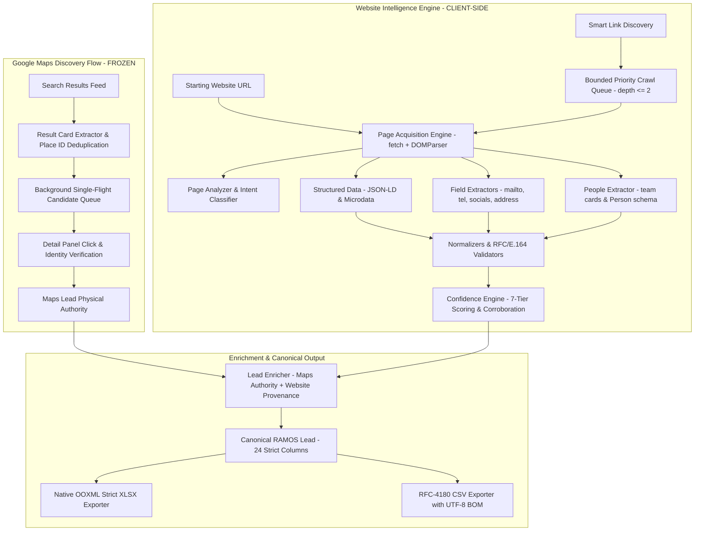

# RAMOS — Final Architecture Specification (v1.0.5)

## 1. Executive Summary & Core Identity

**RAMOS** is a privacy-first, client-side Manifest V3 Chrome Extension combining high-precision **Google Maps Lead Extraction** with deep **Website Intelligence & Targeted Crawling**.

### Primary System Invariants
- **100% Client-Side Execution**: Zero remote servers, zero databases (Supabase completely eliminated), zero external scraping APIs, zero proxies.
- **Zero Runtime NPM Packages**: All DOM analysis, crawler prioritization, people extraction, RFC-4180 CSV generation, and ECMA-376 OOXML Strict Excel (.xlsx) construction execute via browser-native primitives (`Uint8Array`, `TextEncoder`, `DataView`, `DOMParser`).
- **Frozen Google Maps Discovery Baseline**: The core Google Maps search card discovery, single-flight candidate queue, and panel enrichment engine (**v1.0.5**) are permanently frozen and isolated from website crawling logic.

---

## 2. End-to-End System Workflow



---

## 3. Subsystem Breakdown & Component Hierarchy

```
RAMOS Chrome Extension (v1.0.5)
├── Manifest & Config
│   └── extension/manifest.json (MV3 declaration, storage, tabs, scripting, downloads, host_permissions)
├── Popup UI Controller (User Interface)
│   ├── extension/popup.html (Dual-mode navigation: Maps Tab / Website Intelligence Tab, progress, people view, export triggers)
│   ├── extension/popup.js (State controller, Maps run runner, Website crawler, batch lead enricher, export dispatcher)
│   └── extension/popup.css (RAMOS brand design system: deep violet theme, responsive grid, social pills, people list)
├── Background Service Worker (Single Authority Engine)
│   └── extension/background.js (Maps run state authority, candidate queue dispatcher, bounded candidate timeouts, CSV generator)
├── Google Maps Subsystem (FROZEN BASELINE)
│   ├── extension/discovery.js (DOM discovery content worker, bounded scroll engine, candidate queue builder)
│   └── extension/content/maps/
│       ├── dom-utils.js (Element scrolling, DOM query helpers, place ID extraction)
│       ├── selectors.js (Authoritative Google Maps DOM selectors)
│       ├── validators.js (Company name, rating, URL validation rules)
│       ├── address-parser.js (City, region, country, postal code extraction from address strings)
│       ├── result-card-extractor.js (Search result card qualification & Place ID deduplication)
│       ├── detail-extractor.js (Detail panel business data extraction & identity verification)
│       └── maps-adapter.js (Content orchestrator binding extractor scripts to unified API surface)
├── Website Intelligence Subsystem (CLIENT-SIDE TARGETED CRAWLER)
│   └── extension/content/website/
│       ├── page-acquisition.js (Sandboxed HTML acquisition & DOMParser instantiation)
│       ├── page-analyzer.js (Page intent classification, OpenGraph & title/meta extraction)
│       ├── structured-data.js (Schema.org JSON-LD & Microdata parser for Organization, LocalBusiness, Person)
│       ├── field-extractors.js (Protocol & regex extractors for mailto, tel, socials, action links)
│       ├── normalizers.js (E.164 phone, email, URL, and text normalizers)
│       ├── validators.js (RFC 5322 email role filtering, bogus number rejection, domain bounds)
│       ├── crawl-policy.js (Same-domain boundary enforcement, scheme sanitation, binary file exclusion)
│       ├── page-priority.js (Heuristic path scoring: /contact, /about, /team, /locations)
│       ├── link-discovery.js (Same-domain link harvester, relative link resolution, anchor context)
│       ├── crawl-queue.js (Bounded BFS queue, max depth <= 2, early exit logic)
│       ├── people-extractor.js (Team card parser, Person schema, clean name/title separation, generic email isolation)
│       ├── confidence.js (7-tier source reliability weighting, corroboration scoring, deterministic conflict resolution)
│       ├── enricher.js (Additive merge of Maps + Website data, Maps physical field authority, _provenance dictionary)
│       └── website-adapter.js (Master facade orchestrating single-page and multi-page targeted crawls)
└── Shared Models & Output Infrastructure
    ├── extension/shared/constants.js (Error codes, extraction modes, run statuses)
    ├── extension/shared/schema.js (Canonical Lead schema builder: createCanonicalLead, strict 24-field model)
    └── extension/shared/xlsx-builder.js (100% browser-native ECMA-376 OOXML Strict XLSX Excel exporter)
```

---

## 4. Canonical Lead Schema (24 Export Columns)

Every lead extracted from Google Maps, Website Intelligence, or Enrichment produces identical, strictly aligned 24 columns across both CSV and Excel (.xlsx) formats:

| Col # | Canonical Field | Key Name | Export Formatting & Behavior |
| :---: | :--- | :--- | :--- |
| **1** | **Company** | `company_name` | String, left-aligned, width 30. Maps authoritative. |
| **2** | **Phone** | `phone` | Text string (`numFmtId="164"`), preserves leading zeros and international formatting. |
| **3** | **Website** | `website` | URL string, clickable hyperlink in Excel. |
| **4** | **Email** | `email` | String, validated role or individual business email. |
| **5** | **Email Status** | `email_status` | Verification status (`verified_domain`, `business_role`, `external_business`). |
| **6** | **Address** | `address` / `full_address` | String, complete physical address, wrapped cells. |
| **7** | **City** | `city` | Extracted or parsed city name. |
| **8** | **State / Region** | `region` | State, province, or region code. |
| **9** | **Country** | `country` | Country name or standard ISO code. |
| **10** | **Postal Code** | `postal_code` | Text string (`numFmtId="164"`), preserves leading zeros (e.g. `02138`). |
| **11** | **Industry** | `category` | Primary business category or meta industry description. |
| **12** | **Business Type** | `business_type` | Business classification. |
| **13** | **Rating** | `rating` | Numeric decimal value (e.g. `4.8`), right-aligned. |
| **14** | **Reviews** | `review_count` | Numeric integer (e.g. `1250`), right-aligned. |
| **15** | **Opening Status** | `opening_status` | Operating hours status (e.g. `Open 24 hours`, `Closed`). |
| **16** | **Price Range** | `price_range` | Price level indicator (e.g. `$$` / `₹₹₹`). |
| **17** | **Booking URL** | `booking_url` | Clickable reservation / appointment link. |
| **18** | **Ordering URL** | `ordering_url` | Clickable online ordering link. |
| **19** | **Menu URL** | `menu_url` | Clickable digital menu link. |
| **20** | **Imported At** | `imported_at` | ISO 8601 UTC timestamp of extraction. |
| **21** | **Source URL** | `source_url` | Clickable Maps URL or root website URL. |
| **22** | **Place ID** | `place_id` | Unique Google Maps Place ID identifier. |
| **23** | **Source Query** | `source_query` | Search query executed (e.g. `pizza near Gota Ahmedabad`). |
| **24** | **Run ID** | `run_id` | Unique discovery session identifier. |

---

## 5. Security Model, Permissions & Runtime Guardrails

1. **Manifest V3 Isolation**: Content scripts run in isolated worlds on `google.com/maps`. External target websites are fetched directly into memory using `DOMParser`; external scripts are never executed.
2. **Stateless Network Requests**: All `fetch()` calls specify `credentials: "omit"`. The extension never transmits cookies, sessions, credentials, or user identity to target business websites.
3. **CORS Enforcement & Host Permissions**: `host_permissions` declares `http://*/*` and `https://*/*` so the extension popup can directly acquire business website HTML without requiring external proxies or intermediary servers.
4. **Scheme Restrictions**: Only `http:` and `https:` URLs are permitted. Schemes such as `javascript:`, `data:`, `file:`, `chrome:`, and `blob:` are rejected at input sanitization.
5. **Same-Domain Crawler Boundary**: Crawling strictly respects the root domain boundary (`crawl-policy.js`). The crawler never leaves the target business domain.
6. **XSS & DOM Safety**: Scraped strings are bound exclusively via `textContent` and safe DOM elements, preventing arbitrary HTML or script injection.
7. **Zero Remote Dependencies**: The extension operates entirely offline/local once installed in Chrome.
