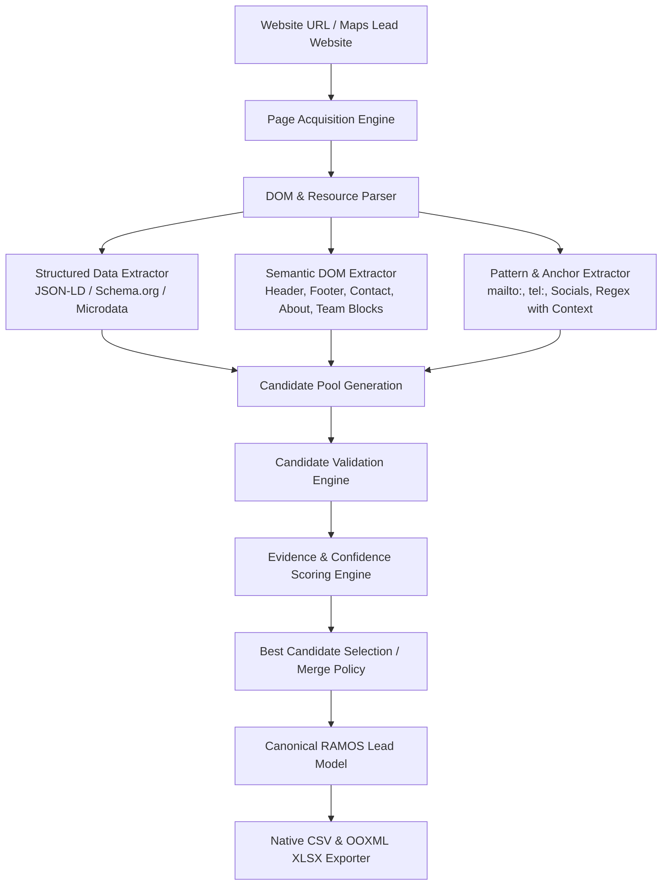

# RAMOS Website Intelligence & Smart Extraction Architecture

## 1. Executive Summary

**RAMOS Website Intelligence** is a standalone, browser-native intelligence and extraction subsystem designed to extract rich business, contact, social, and personnel information directly from company websites.

Operating inside the **RAMOS Manifest V3 Chrome Extension**, this engine requires **0 runtime npm packages**, **0 backend servers**, **0 external APIs**, and **0 proxy dependencies**. It adheres strictly to the rule:

> **URL → Page Acquisition → Page Analysis → Structured Data → Semantic DOM → Pattern Extraction → Candidate Generation → Validation → Evidence Scoring → Canonical RAMOS Lead → CSV / XLSX**

---

## 2. Core Operational Philosophy



### Architectural Guardrails
1. **Zero Maps Engine Regression**: The Google Maps discovery, qualification, panel enrichment, and queue runner engines are **STABLE AND FROZEN**. All website extraction code resides in isolated modules (`extension/content/website/*`, `extension/shared/website-*`).
2. **Adaptive Element Matching**: No hardcoded fragile CSS selectors (e.g. `.company-name-v2`). Instead, extract using structured data schemas, semantic microdata, microformats, standard HTML tags, semantic role attributes, and NLP/pattern heuristics.
3. **Evidence-Based Extraction**: Every field candidate is tagged with its provenance, source type, raw value, extraction location, and numerical confidence score.
4. **Prefer Empty over Wrong**: If confidence does not meet the minimum threshold, leave the field empty. Never fabricate data or associate third-party information with the target company.

---

## 3. Component Hierarchy & Module Breakdown

```
extension/
├── manifest.json                  # MV3 permissions (storage, tabs, scripting, downloads, host_permissions)
├── background.js                  # Background Service Worker (Session authority, Queue dispatcher)
├── popup.html                     # Dual-mode UI (Google Maps Tab / Website Extraction Tab)
├── popup.js                       # UI controller, state management, live extraction feed
├── popup.css                      # RAMOS Design System styles (dark/light themes, badges, buttons)
├── discovery.js                   # Maps Content Script (FROZEN)
├── shared/
│   ├── constants.js               # Error codes, extraction modes, run statuses
│   ├── schema.js                  # Canonical RAMOS Lead schema (createCanonicalLead)
│   ├── xlsx-builder.js            # OOXML Strict Excel Spreadsheet Generator
│   ├── website-schema.js          # Website-specific candidate & evidence data structures
│   └── website-merge.js           # Multi-page candidate deduplication & Maps enrichment merge
└── content/
    ├── maps/                      # [FROZEN] Google Maps Extraction Subsystem
    │   ├── dom-utils.js
    │   ├── selectors.js
    │   ├── validators.js
    │   ├── address-parser.js
    │   ├── result-card-extractor.js
    │   ├── detail-extractor.js
    │   └── maps-adapter.js
    └── website/                   # [NEW] Website Intelligence Subsystem
        ├── page-analyzer.js       # Page classifier, metadata & language detector
        ├── structured-data.js     # JSON-LD & Schema.org microdata parser
        ├── field-extractors.js    # Contact, company, social, and action link extractors
        ├── normalizers.js         # Phone (E.164/international), URL, email, text normalizers
        ├── validators.js          # Strict syntax, RFC 5322 email, bogus number filtering
        ├── confidence.js          # Source weight, context boost, evidence scoring engine
        ├── link-discovery.js      # On-page link discoverer, priority scorer (/contact, /about, /team)
        ├── crawl-queue.js         # Bounded in-memory crawl queue, domain isolation, depth control
        ├── people-extractor.js    # Team & leadership card analyzer, role association
        └── website-adapter.js     # Master facade orchestrating single-page & multi-page extraction
```

---

## 4. End-to-End Extraction Pipeline

### Step 1: Page Acquisition (`website-adapter.js`)
- Accepts a sanitized starting URL (e.g. `https://example.com`).
- Fetches HTML content directly via native `fetch()` or tab DOM inspection.
- Enforces timeout boundaries (10 seconds per page) and size limits (max 2.5 MB).
- Parses raw HTML into a DOM tree using standard `DOMParser`.

### Step 2: Page Analysis (`page-analyzer.js`)
- Detects page title, meta description, OpenGraph tags, Twitter cards, canonical URL, and favicon.
- Classifies page type: `HOMEPAGE`, `CONTACT`, `ABOUT`, `TEAM`, `SERVICES`, `LOCATION`, `GENERIC`.

### Step 3: Multi-Strategy Extraction
- **Structured Data (`structured-data.js`)**: Extracts and traverses all `<script type="application/ld+json">` objects, looking for `@type`: `Organization`, `LocalBusiness`, `Corporation`, `PostalAddress`, `ContactPoint`, `Person`.
- **Semantic DOM (`field-extractors.js`)**: Scans header, footer, `<address>`, `<main>`, and semantic containers for explicit business identity and contact details.
- **Anchor & Link Heuristics**: Extracts `mailto:` (emails), `tel:` (phones), and social profiles matching known patterns (LinkedIn, Facebook, Instagram, Twitter/X, YouTube, TikTok, GitHub).
- **People & Team Intelligence (`people-extractor.js`)**: On `/team`, `/about`, `/people`, `/leadership` pages, isolates team cards, extracting person name, title/designation, profile link, and direct LinkedIn profile.

### Step 4: Normalization & Validation (`normalizers.js`, `validators.js`)
- Standardizes phone numbers, strips tracking query parameters from social URLs, cleans whitespace and multiline strings, and validates emails against disposable/placeholder patterns.

### Step 5: Evidence Scoring & Candidate Selection (`confidence.js`)
- Ranks conflicting candidates across pages using source priority (JSON-LD > Mailto/Tel > Semantic Label > Raw Pattern).
- Retains only candidates exceeding the confidence threshold (default: `>= 0.50`).

### Step 6: Canonical Conversion & Export
- Formats the consolidated result into the authoritative `createCanonicalLead()` structure.
- Exports seamlessly via RAMOS's native CSV and OOXML Strict XLSX generators.
