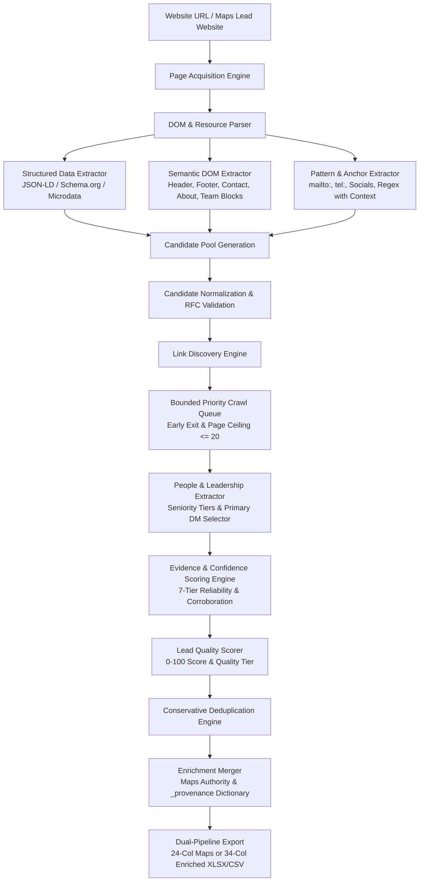

# RAMOS Website Intelligence & Smart Extraction Architecture

**Current Version:** `v1.0.6`  
**Current Phase:** Phase 9 (Release Candidate / Pilot Ready)  
**Status:** **CODE FROZEN**  
**Next Phase:** Phase 10 (Multi-Website & Corporate Relationship Intelligence — PLANNED)

---

## 1. Executive Summary

**RAMOS Website Intelligence** is a browser-native intelligence and extraction subsystem designed to discover rich business identity, contact, social, and executive information directly from company websites.

Operating inside the **RAMOS Manifest V3 Chrome Extension**, this engine requires **0 runtime npm packages**, **0 backend servers**, **0 external APIs**, and **0 proxy dependencies**.

The pipeline executes deterministically:
> **Target URL → Page Acquisition → Page Analysis → Structured Data → Semantic DOM → Pattern Extraction → Normalization & RFC Validation → Link Discovery → Bounded Crawl Queue → People & Seniority Extraction → Evidence & Confidence Scoring → Lead Quality Scoring → Conservative Deduplication → Enrichment Merger → 24-Col Maps or 34-Col Enriched Export**

---

## 2. Core Operational Architecture



### Architectural Guardrails
1. **Zero Maps Engine Regression**: The Google Maps discovery, qualification, panel enrichment, and queue runner engines are **STABLE AND FROZEN (v1.0.5 baseline)**. All website extraction code resides in isolated modules (`extension/content/website/*`, `extension/shared/`).
2. **Deterministic & Evidence-Based**: Every extracted field is tagged with its provenance, source type, raw value, extraction page, and numerical confidence score ($0.00 - 1.00$). No AI or LLM hallucinations.
3. **Prefer Empty over Wrong**: If confidence does not meet the minimum threshold, leave the field empty (`null`). Never fabricate or attribute employee personal info to the company.
4. **Strict Personal Contact Isolation**: Employee personal emails or direct phones attach strictly to `lead.people[i]` and `lead.decision_maker_*`. They never overwrite company primary email or phone.

---

## 3. Component Hierarchy & Module Breakdown

```
extension/
├── manifest.json                  # MV3 permissions (storage, tabs, scripting, downloads, host_permissions)
├── background.js                  # Background Service Worker: run authority, queue dispatcher, candidate timeouts
├── popup.html                     # Dual-mode UI: [ Google Maps ] [ Website Intelligence ]
├── popup.js                       # UI controller, state management, batch enricher, export routing
├── popup.css                      # RAMOS Design System: Deep Violet theme (#7C3AED), badges, people view
├── discovery.js                   # Maps Content Script (FROZEN)
├── shared/
│   ├── constants.js               # Error codes, extraction modes, run statuses
│   ├── schema.js                  # Canonical RAMOS Lead schema (createCanonicalLead)
│   ├── deduplicator.js            # High-precision conservative deduplication & lead merger
│   └── xlsx-builder.js            # Browser-native ECMA-376 OOXML Strict XLSX Generator (buildXlsx & buildWebsiteXlsx)
└── content/
    ├── maps/                      # [FROZEN] Google Maps Extraction Subsystem (v1.0.5)
    │   ├── dom-utils.js
    │   ├── selectors.js
    │   ├── validators.js
    │   ├── address-parser.js
    │   ├── result-card-extractor.js
    │   ├── detail-extractor.js
    │   └── maps-adapter.js
    └── website/                   # Website Intelligence Subsystem (Phases 0–9)
        ├── page-acquisition.js    # Sandboxed HTML fetcher & DOMParser instantiation
        ├── page-analyzer.js       # Page intent classifier, OpenGraph & meta description extractor
        ├── structured-data.js     # JSON-LD & Schema.org microdata parser for Organization, LocalBusiness, Person
        ├── field-extractors.js    # Contact, company, social, and action link extractors
        ├── normalizers.js         # Phone (E.164), email, URL, text cleaning normalizers
        ├── validators.js          # RFC 5322 email role filtering, bogus number rejection, domain bounds
        ├── crawl-policy.js        # Same-domain boundary enforcement, scheme sanitation, binary & auth exclusions
        ├── page-priority.js       # URL path & anchor text priority scoring (/contact, /about, /team, /locations)
        ├── link-discovery.js      # Same-domain link discoverer with anchor context & dynamic field-awareness
        ├── crawl-queue.js         # Dynamic priority queue, depth control (<=2), page budgets, early exit
        ├── people-extractor.js    # Team & leadership card parser, Person schema, seniority ranking
        ├── confidence.js          # 7-tier source reliability weighting, corroboration bonuses, conflict resolver
        ├── lead-scorer.js         # Deterministic lead quality scoring (0-100) & quality tier assignment
        ├── enricher.js            # Merges Maps + Website leads with Maps authority & _provenance dictionary
        └── website-adapter.js     # Master facade orchestrating single-page extraction & targeted crawling
```

---

## 4. End-to-End Extraction Pipeline Details

### Step 1: Page Acquisition (`page-acquisition.js`)
- Accepts a sanitized starting URL (e.g. `https://example.com`).
- Fetches HTML content directly via native `fetch()` or tab DOM inspection.
- Enforces timeout boundaries:
  - **Batch enrichment page fetch**: 6,000 ms (`popup.js:829`)
  - **Interactive website crawl fetch**: 10,000 ms (`popup.js:1040`)
- Enforces size limits (max 2.5 MB) and parses HTML into a DOM tree using standard `DOMParser`.

### Step 2: Page Analysis (`page-analyzer.js`)
- Detects page title, meta description, OpenGraph tags, Twitter cards, and canonical URL.
- Classifies page type: `HOMEPAGE`, `CONTACT`, `ABOUT`, `TEAM`, `SERVICES`, `LOCATION`, `GENERIC`.

### Step 3: Multi-Strategy Candidate Extraction
- **Structured Data (`structured-data.js`)**: Traverses `<script type="application/ld+json">` and Microdata for `Organization`, `LocalBusiness`, `PostalAddress`, `ContactPoint`, `Person`.
- **Semantic DOM (`field-extractors.js`)**: Scans header, footer, `<address>`, `<main>`, and semantic containers for explicit business identity and contact details.
- **Anchor & Link Protocols**: Extracts `mailto:` (emails), `tel:` (phones), and verified social profiles (LinkedIn, Twitter/X, Facebook, Instagram, YouTube, GitHub).
- **People & Team Intelligence (`people-extractor.js`)**: Isolates team cards on `/team`, `/about`, `/people`, `/leadership`, extracting person name, title, profile link, direct email/phone, and LinkedIn URL.

### Step 4: Normalization & RFC Validation (`normalizers.js`, `validators.js`)
- Standardizes phone numbers, strips tracking query parameters from URLs, cleans whitespace, and validates emails against RFC 5322 and disposable domain blacklists.

### Step 5: Link Discovery & Bounded Crawling (`link-discovery.js`, `crawl-queue.js`)
- Discovers same-domain internal links and dynamically scores priority based on missing fields.
- Bounded crawl queue limits: hard ceiling of 20 pages (1, 5, 10, 20), max depth 2 hops, early stopping when all key business intelligence fields are satisfied.

### Step 6: Evidence Scoring & Conflict Resolution (`confidence.js`)
- Computes confidence scores using 7 tiers of source reliability ($0.50 - 0.98$).
- Adds context boosts for high-value pages (`/contact`, `/about`) and applies cross-page corroboration bonuses.
- Deterministically resolves conflicting candidates.

### Step 7: Lead Quality Scoring (`lead-scorer.js`)
- Evaluates complete lead across identity, contactability, executive discovery, and digital footprint.
- Assigns 0–100 score and `quality_tier` (`HIGH`, `MEDIUM`, `LOW`).

### Step 8: Conservative Deduplication (`deduplicator.js`)
- Deduplicates leads using `place_id`, domain+phone, or domain+high name similarity ($\ge 0.75$).
- Unions all discovered corporate emails, phones, people, and social profiles.

### Step 9: Enrichment Merger (`enricher.js`)
- Merges Google Maps lead with Website Intelligence.
- Enforces strict Maps authority for physical fields (`company_name`, `phone`, `address`, etc.).
- Attaches field-level `_provenance` dictionary.

### Step 10: Export Engine (`xlsx-builder.js`, `popup.js`)
- Produces clean 24-column Maps exports or 34-column Enriched exports with a 2-sheet XLSX workbook (Sheet 1: Leads, Sheet 2: People).
